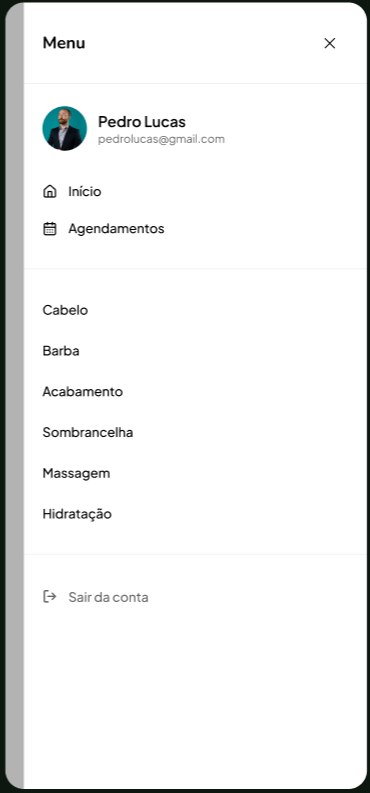

## Visão Geral

- Crie o menu que está em igual do do Figma como no print abaixo:
  

## Requisitos Funcionais

- Deve ser exibido o botão de login se o usuário estiver deslogado. Se ele estiver logado, exiba o
  Avatar, nome e email (por enquanto, tudo hard-coded). como esta nesses prints:
  
  

- Botão de "Agendamentos" deve levar para "/bookings".
- Botão de categorias (cabelo, barba, etc.) devem levar para "/barbershops?search={termo}".
  Veja um exemplo em @components\quick-search\index.tsx.
- Use o componente Sheet do shadcn para exibir o menu.
- Botão de "Sair" da conta não deve fazer nada, por enquanto.
- Esse componente deve ser aberto ao clicar no botão do menu do @components\header\index.tsx.
