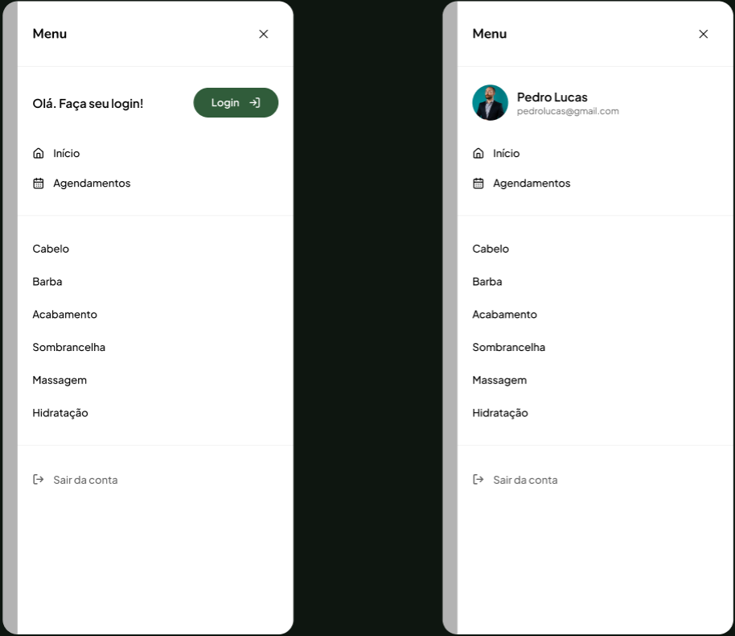
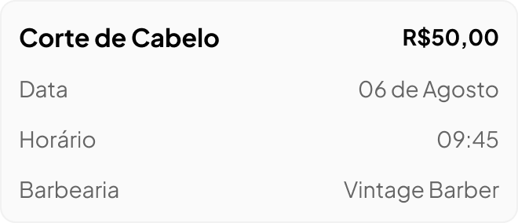

## Visão Geral

- Crie o componente que está no Figma: https://www.figma.com/design/MjPBixQgRLv3hG47dzsS3a/Aparatus-%7C-Alunos?node-id=78-1818&t=mlOVYrl6SGqznP0I-4
  identico ao print abaixo:
  .

## Requisitos Funcionais

- Esse componente deve ser feito com o Sheet do shadcn.
- Deve ter o mesmo tamanho do menu em @components\menu\index.tsx.
- Ele deve ser aberto ao clicar no botão "Reservar" em @components\service-item\index.tsx.
- Use o componente calendar do shadcn.
- Ao selecionar um dia do caléndario, exiba os horários das 08 ás 17h, todos com intervalo ed 30 minutos entre eles. Por exemplo: 08:00, 08:30, 09:00, 09:30.
- Os horários devem ter um scrollbar horizontal.
- Somente renderize o card com o resumo do agendamento
  que esta em https://www.figma.com/design/MjPBixQgRLv3hG47dzsS3a/Aparatus-%7C-Alunos?node-id=235-335&t=mlOVYrl6SGqznP0I-4 quando o horário e o dia forem selecionados.
  print do card: .
- Ao selecionar um dia, se houver algum horário que ja foi selecionado por outro usuario, limpe esse horário indisponivel.
- Desabilitar botão de "Confirmar" enquanto dia e horário não forem selecionados.

## Requisitos Técnicos

- Armazene o dia selecionado e os horários em um state.
